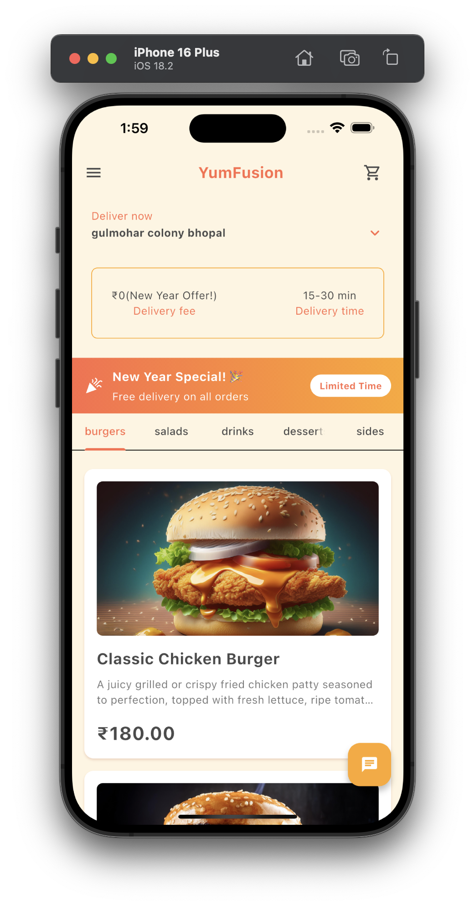
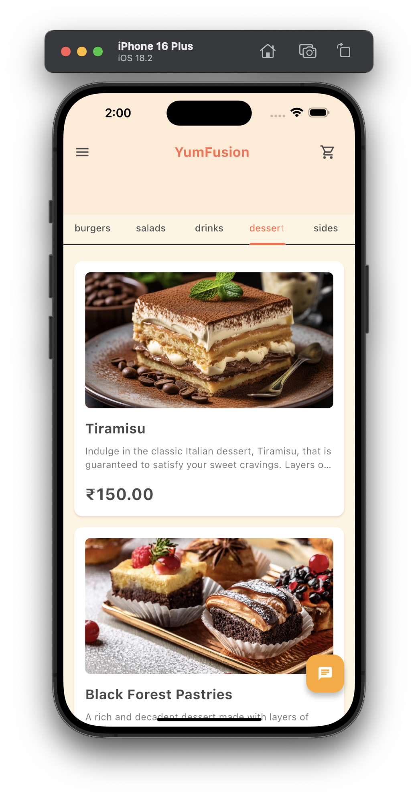
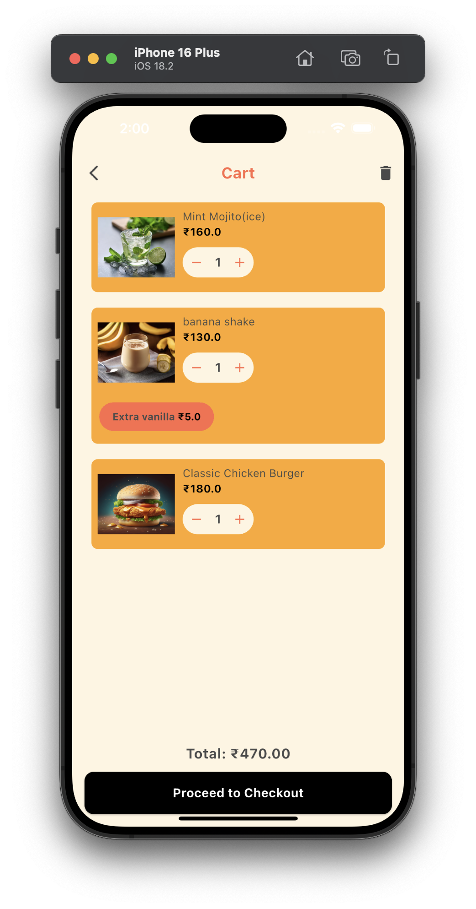
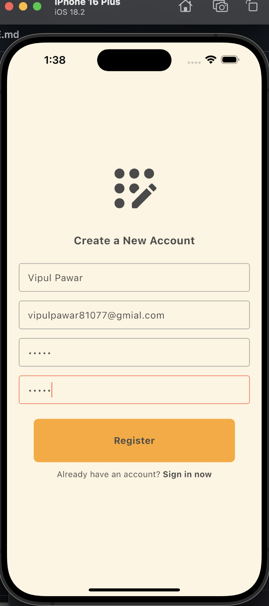
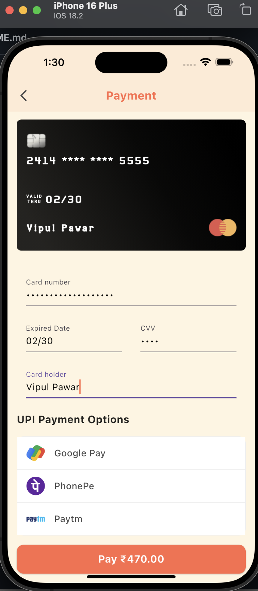
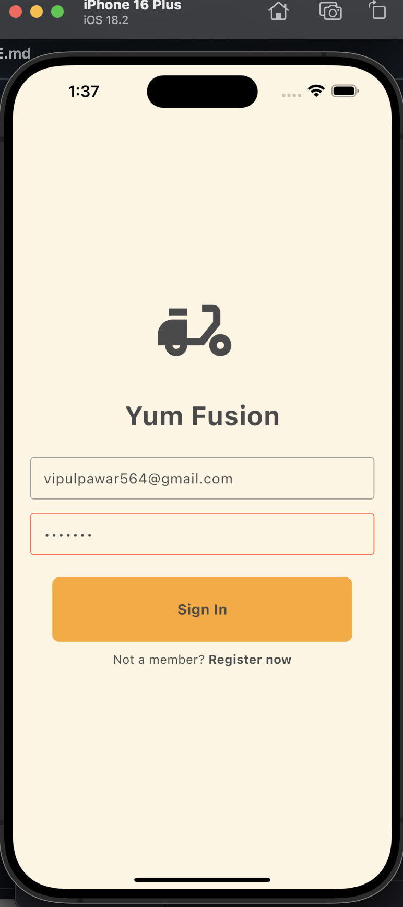
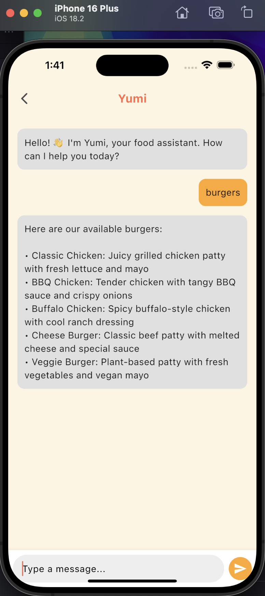

# 🍽️ YumFusion - Smart Food Ordering App


*A seamless food ordering experience at your fingertips!*  

## 🚀 Features

- ✅ **User Authentication** (Login/Signup with Firebase)
- ✅ **Categorized Menu** (Burgers, Salads, Sides, Drinks, Desserts)
- ✅ **Cart & Order Tracking** (Real-time updates stored in Firebase)
- ✅ **UPI Payments & Receipts** (Secure & hassle-free transactions)
- ✅ **Dark Mode** (Enhanced user experience)

## 📸 Screenshots

<table>
  <tr>
    <th>Home Page</th>
    <th>Menu Page</th>
    <th>Cart Page</th>
  </tr>
  <tr>
    <td></td>
    <td></td>
    <td></td>
  </tr>
</table>

<table>
  <tr>
    <th>Register Page</th>
    <th>Payment Page</th>
    <th>SignIn Page</th>
  </tr>
  <tr>
    <td></td>
    <td></td>
    <td></td>
  </tr>
</table>

### 🤖 AI YUMI - Chat Assistant

<p align="center">
  
</p>

## 🎥 Demo Videos

- [Demo Video 1](https://www.youtube.com/watch?v=xhc25d2YjYc&t=41s) - Overview of the app
- [Demo Video 2](https://www.youtube.com/watch?v=nhySdaRNr6I) - Order placement & tracking of the order

## 🛠️ Tech Stack

- **Framework:** Flutter
- **Backend & Database:** Firebase
- **Authentication:** Firebase Auth
- **Payments:** UPI Integration

## 📲 Installation & Setup

1. **Clone the Repository:**
   ```bash
   git clone https://github.com/yourusername/yumfusion.git
   cd yumfusion
   
   ```
2. **Install Dependencies:**
   ```bash
   flutter pub get
   ```
3. **Run the App:**
   ```bash
   flutter run
   ```

## 🐜 License

This project is licensed under the **MIT License**. Feel free to use and modify it.

---

🌟 **Like this project? Give it a star on GitHub!** ⭐
